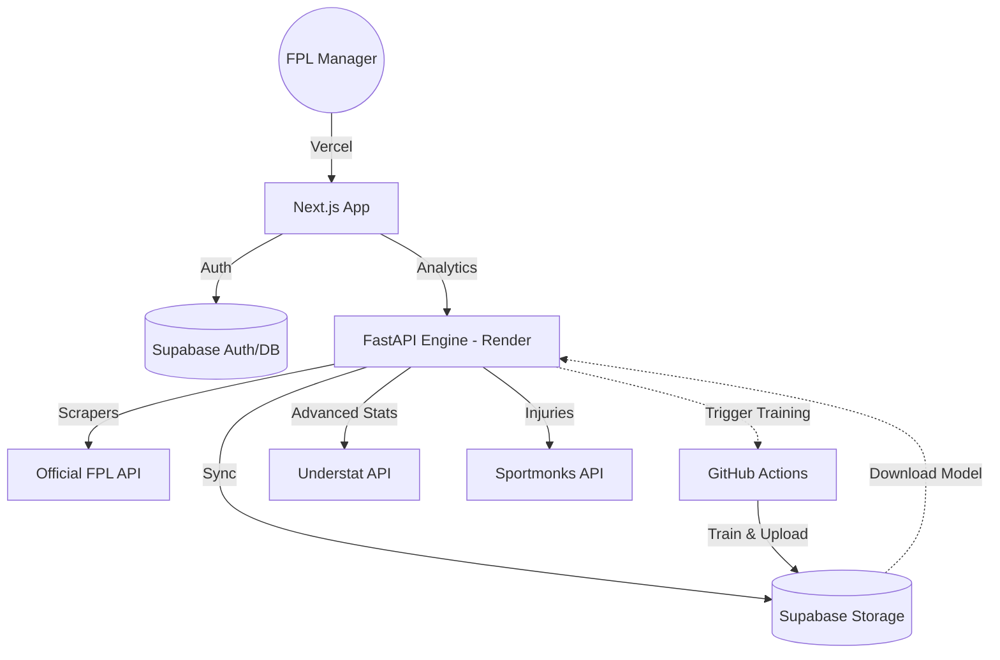

# FPL Assistant: Public Documentation & Media

Welcome to the public documentation repository for the **FPL Assistant** – an intelligent, full-stack squad planner and predictive analytics engine for Fantasy Premier League.

## 🚀 Overview

FPL Assistant is designed to bridge the gap between raw data and winning strategies. It combines a high-performance Python backend for ML modeling and simulations with a futuristic Next.js frontend for manager insights.

### Key Capabilities:
- **Predictive Analytics**: LightGBM ensembles trained on historical form, rotation risk, and fixture difficulty.
- **Monte-Carlo Simulations**: Evaluating millions of possible transfer paths to find the optimal strategy.
- **Automation**: Fully automated gameweek cycles powered by GitHub Actions and Supabase.
- **Secure Auth**: Production-grade authentication and credential vaulting.

## 🏗️ System Architecture

## 📄 Technical Guides

For deep dives into specific system components, please refer to our technical documentation:

- [**ML Training Architecture**](docs/ML_TRAINING_ARCHITECTURE.md): Detailed explanation of our remote training pipeline via GitHub Actions and Supabase model synchronization.
- [**Algorithm & Capabilities Deep-Dive**](docs/ALGORITHM_DOCUMENTATION.md): Full documentation of the LightGBM model, 67-feature set, and multi-objective optimization function.
- [**Deployment Guide**](https://github.com/ShadrachAroni/fpl-assistant/blob/main/DEPLOYMENT.md): Instructions for hosting the frontend on Vercel and the backend on Render.

## 📺 Media & Demos

*[Coming Soon: Dashboard Walkthrough Video]*
*[Coming Soon: Prediction Engine Demo]*

---

**Main Repository**: [ShadrachAroni/fpl-assistant](https://github.com/ShadrachAroni/fpl-assistant)
