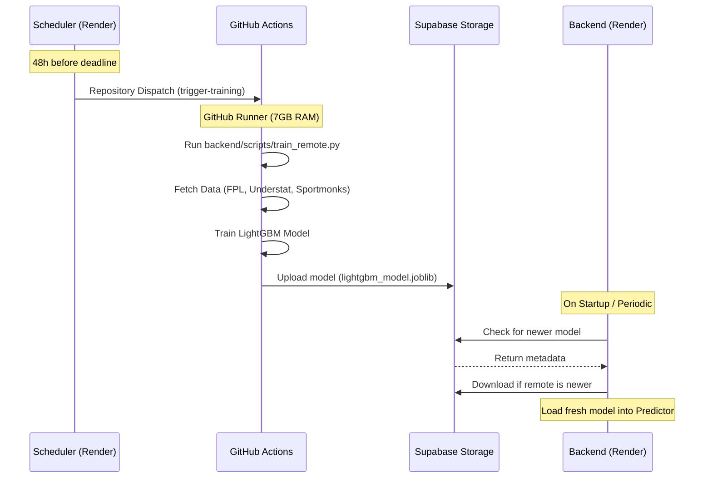

# ML Training Flow: Remote Architecture

FPL Assistant uses a decoupled, high-memory training architecture to overcome VPS limitations and ensure model reliability. The heavy computational workload of training LightGBM ensembles is offloaded to GitHub Actions, with models persisted in Supabase Storage.

## 🏗️ Architecture Overview

## 🔄 The Pipeline Components

### 1. The Trigger: `scheduler.py`
The scheduler runs a background thread on the Render backend. It polls the FPL API and, when within 48 hours of a deadline, sends an authenticated request to the GitHub API (`repository_dispatch`).

### 2. The Engine: GitHub Actions
The workflow in `.github/workflows/ml_training.yml` runs on an Ubuntu runner with significantly more RAM than a standard free-tier VPS.
- **Environment**: Python 3.11 with full `requirements.txt` dependencies.
- **Execution**: Runs `backend/scripts/train_remote.py`.
- **Secrets**: Requires `SUPABASE_URL`, `SUPABASE_SERVICE_ROLE_KEY`, and `SPORTMONKS_API_TOKEN`.

### 3. Persistence: Supabase Storage
Trained models are uploaded to the `models` bucket. This serves as the "Source of Truth" for production models, allowing them to survive Render redeployments or container restarts.

### 4. Synchronization: `Predictor` Class
The production backend remains extremely lean. When the `Predictor` is initialized (e.g., during app startup), it:
1.  Connects to Supabase.
2.  Compares the `created_at` timestamp of the remote model with the local file.
3.  Downloads the remote model only if a newer version exists.

## 🛠️ Performance Benefits
- **Zero OOM Risk**: Training on 7GB+ runners avoids Out-of-Memory crashes on specialized VPS instances.
- **Persistence**: Models are no longer lost when the Render ephemeral container restarts.
- **Cost Effective**: Utilizes free private GitHub Actions minutes and Supabase's free storage tier.
- **Separation of Concerns**: The API server focuses on serving requests, while GitHub handles the heavy lifting.

## ⚙️ Manual Options
You can manually trigger a training run at any time via the **GitHub Actions tab** in your repository by selecting the "ML Training Pipeline" and clicking `Run workflow`.
